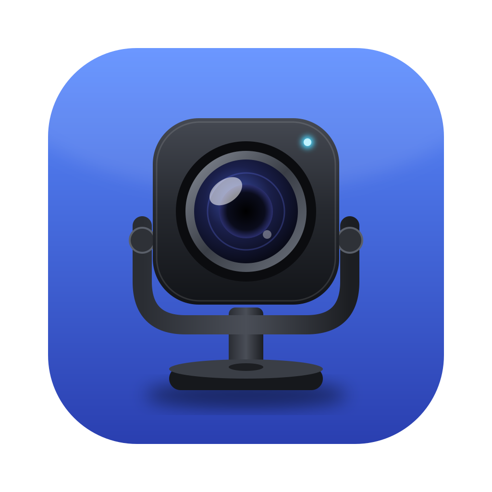

<p align="center"></p>

# ObsbotBar

Menu bar app for the OBSBOT Tiny 2 on macOS: sleep, wake, and Normal (face-following) tracking. It works without OBSBOT Center.

Tracking is on by default. The app turns it on at launch, whenever the camera is plugged in, and after it wakes the camera.

## Build and run

Needs only the Xcode Command Line Tools.

```sh
make run       # build build/ObsbotBar.app and open it
make install   # copy it to /Applications
```

The binary also works as a CLI, which is handy for scripting:

```sh
.build/release/ObsbotBar status | wake | wake-only | sleep | track | untrack | pose | aim PAN TILT
```

## How it works

The app sends vendor commands over the camera's UVC Extension Unit (unit 2), using IOKit control transfers on the USB default endpoint. Other apps can keep streaming video while it does this. The protocol was reverse-engineered by [lxman/obsbot-mcp](https://github.com/lxman/obsbot-mcp) (MIT):

| Action | XU selector | Payload (60 bytes, zero-padded) |
|---|---|---|
| Status | 6 (GET_CUR) | byte `0x02` = asleep; bytes `0x18`/`0x1C` = AI mode (2,0 = normal) |
| Normal tracking on / off | 6 | `16 02 02 00` / `16 02 00 00` |
| Sleep / wake | 2 | V3 frame, cmd `0xA0C2`, payload `01`/`00` |

The app opens the device for each command and closes it straight after, so OBSBOT Center can still be used. If both send commands at the same moment, one of them gets an "in use" error.

## License

MIT. See [LICENSE](LICENSE).
